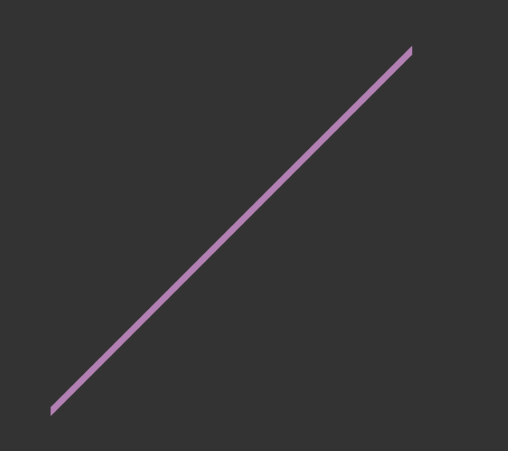
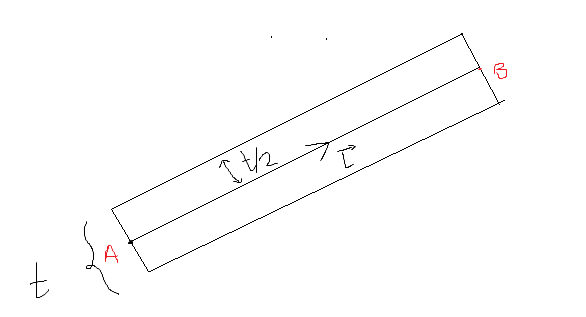

# Welcome to Tilak Chad Pages

Greetings, this is my first blog on programming (or anything else). I hope you would enjoy it.

## [Graphics Programming] 
## Rendering smooth anti-aliased thick lines 
It sure sounds easy, doesn't it? Its just rendering a line not a world, you say. But drawing perfect smooth (anti-aliased) thick lines is quite a challenging task. 
We will go through some possible options of rendering lines.

So let's get started. 

## The obvious way 
The obvious way to draw thick lines in renderer is to use builtin function to adjust line thickness. 
In case of OpenGL, it is <br>
`glLineWidth(width)`, where width is in screen pixel 
<br>
DirectX have no such builtin function but don't worry. You aren't alone who can't draw nice lines xD. There's no current GPU that can draw thick lines natively in the hardware. OpenGL fakes the thick line by drawing polygons. 

The output for a typical line with width 15 as drawn by OpenGL is : 

<p align="left">
	
</p>


Sounds fine, right? 
Let's see what happens if we try to draw line_strips : 

<p align="left">
	
</p>

You mightn't believe it, but these two lines have same width, according to OpenGL, not by us. And yes, they do have, in a sense.  
The reason why their width looks different, as drawn by OpenGL, is explained in GL docs. If del(X) >= del(Y), 
`width` pixels are filled along each column. But, since line is tilted, the total length across its normal boundaries is less than its vertical width. Actual experimentation is left to the readers as an exercise. :D  

We will solve this problem. In fact, its quite easy to solve this problem. Even if we fixed the line width somehow, we are still left with another problem. 
It will be fine for drawing a single line, but while rendering multiple connected line using LINE_STRIP topology, we can clearly see the disconnected lines ruining our beautiful lines. 


### Drawing Lines, the easy way 

The first approach to try to render fixed width lines is not drawing lines at all. Instead, using TRIANGLES topology to plot a thin quad that will approximate line quite nicely. 
Notice the lines below, we want lines endpoint to be normal to the direction of line, rather than being vertical or horizontal. 

<p align="left">
	
</p>

In the figure above, 
let A = (x0,y0) and B = (x1, y1) 
Then, vector from A to B is given as, 
L = B - A = (x1 - x0, y1 - y0)
There are two vectors normal to this in 2D Euclidean plane. The counterclock one to the current direction of line can be obtained as : 
N = (L.y, -L.x)
L and N are both orthogonal to each other as can be easily verified using dot product. 

Normalizing the N normal vector, 
N cap = N / ||N|| 
This gives unit vector perpendicular to the line's direction. 
Scaling it by thickness/2, 
n = (N cap) / 2

Now adding this normal vector to both end and subtracting it to both end, gives four co-ordinates that draws thick line. 

The resulting quad need to be drawn using TRIANGLES topology now. 

<p align="left">
	
</p>

Two trianges need to be drawn for each line now, 
namely 
`Triangle(P0,P1,P2) and Triangle(P1,P2,P3)`

```c
#include <stdio.h> 

int main(int argc, char** argv)
{
  return 0; 
}
```

Blog in progress ... 


### References
